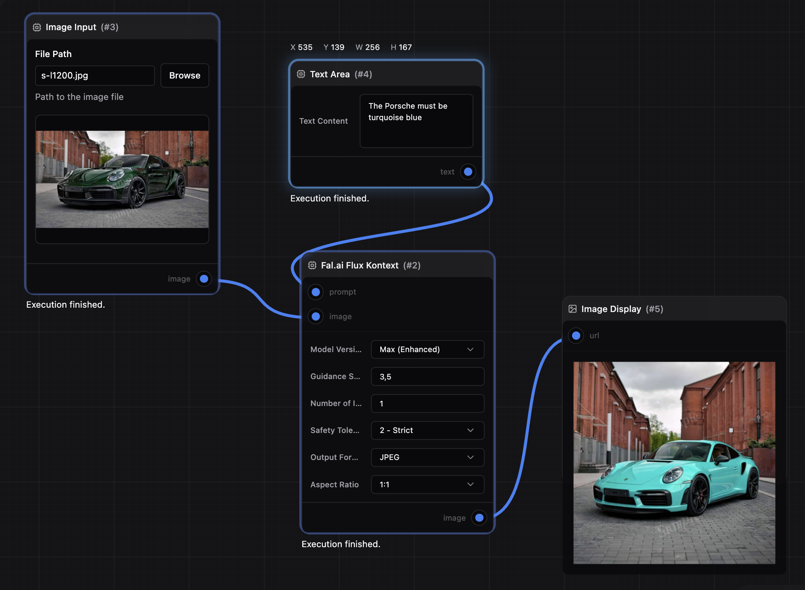

# Nano Fal AI NodeServer

Nano Fal AI ships a NanoCore NodeServer that plugs your NanoGraph workflows straight into the Fal.ai ecosystem. You get image, video, vision, and 3D pipelines wired up without touching the Fal SDK yourself.



## Quick install
```bash
npx nanocore add spartanz51/nano-fal
npx nanocore env nano-fal-ai FAL_KEY <YOUR_FAL_API_KEY>
```

## Highlights
- Automatic conversion of Fal outputs into NanoGraph assets.
- Live Fal progress updates and errors surfaced inside the NanoGraph UI.
- Fal parameters exposed so you keep control over guidance, seeds, formats, and more.

## Available models
Each folder under `src/nodes` is a ready-to-use family of Fal models:

- **Flux Pro** – text-to-image, remix, inpainting, and Control workflows (`fal-ai/flux-pro`: New, v1.1, Ultra, Fill, Canny, Depth, Redux).
- **Flux Kontext** – multi, text-to-image, and guided edit endpoints (`fal-ai/flux-pro/kontext`, Pro & Max).
- **Flux-1 Krea** – text-to-image, image-to-image, and redux (`fal-ai/flux-1/krea`).
- **Flux SRPO** – classic and Flux-1 versions of SRPO (`fal-ai/flux/srpo`, `fal-ai/flux-1/srpo`).
- **Seedream v4** – Bytedance text-to-image and edit (`fal-ai/bytedance/seedream/v4`).
- **Seedance v1** – text-to-video, image-to-video, and reference-driven video (Lite & Pro).
- **Veo 3** – text-to-video and image-to-video (standard and fast modes).
- **Kling Video v2.1** – high fidelity image-to-video.
- **Gemini Flash Edit** – multi-region image editing.
- **Moondream2** – image description, visual Q&A, object and point detection.
- **Image Apps v2** – photo effects, face retouching, makeup, relighting, style transfer, virtual try-on, and more.
- **Hunyuan3D** – 3D asset generation (v2 and v2.1).
- **Nano Banana** – stylized image generation with captions.

## Project layout
- `src/nodes` – Fal node implementations grouped by model family.
- `src/utils` – Fal client setup, progress reporting, and parameter helpers.
- `nanoserver.json` – NanoCore metadata (port, node path, server name).

## Support & contributions
Issues and pull requests are welcome. Please mention the Fal model involved and share your NanoGraph workflow to help reproduce.
